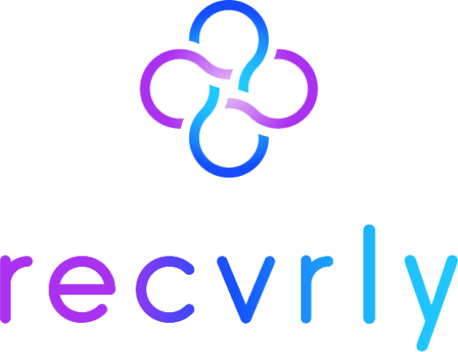

<p align="center">
  
</p>

<h3 align="center">Your Recovery Companion.</h3>

<p align="center">
  A mobile app built for people in recovery — combining real-time peer support, sobriety tracking, crisis tools, and community in one beautifully designed experience.
</p>

<p align="center">
  
  
  
  
  
</p>

---

## What is Recoverly?

Recovery is one of the hardest journeys a person can take — and no one should have to take it alone.

Recoverly is a **full-stack mobile app** that wraps everything a person in recovery needs into a single compassionate tool:

- A **sobriety counter** that celebrates every second of progress
- An **SOS system** built for moments of real crisis
- **Live video and chat** to connect with peers and supporters
- A **community feed** to share milestones and stay accountable
- **Journals, goals, meetings, and resources** — all in one place

---

## Features

### 🕐 Sobriety Tracking
A live, always-on counter showing exactly how many days, hours, minutes, and seconds sober. Visual milestone badges unlock at 1, 7, 30, 60, and 90 days with shareable celebration cards. Weekly streak dots keep the momentum going.

### 🆘 SOS — Crisis Support
When things get hard, one tap opens a full crisis system. Five guided paths (feeling like using, just relapsed, self-harm thoughts, bad day, anxiety) with tailored support content. Direct lines to SAMHSA (1-800-662-4357) and the 988 Suicide & Crisis Lifeline. Your trusted Inner Circle contacts are one tap away.

### 💬 Real-Time Chat & Video Calls
Full one-on-one messaging powered by Stream Chat — search users, start DMs, stay in touch. When a conversation needs more than text, jump straight into a live video or audio call without leaving the app.

### 🌐 Community Feed
Post milestones, share check-ins, and celebrate each other. React with hearts, leave comments, and build the kind of accountability that actually sticks.

### 🎯 Goal Setting
Set and track goals across four categories — Recovery, Health, Personal, and Work. Create, edit, complete, or remove goals as your journey evolves.

### 📓 Journaling
A private space to reflect. Log your mood with an emoji picker, write freely, and build a personal record of your recovery story over time.

### 📅 Meetings Directory
Find AA, NA, and SMART Recovery meetings with direct links to official sites. Search by type, day, or time.

### 🤝 Sober Pal Network
Browse other users in recovery, see how many days they've been sober, start a conversation, or jump on a call. Nobody recovers alone.

### 📚 Resource Hub
Crisis hotlines, therapist finders, meditation apps, and support group links — curated and one tap away.

---

## Tech Stack

| Layer | Technology |
|---|---|
| **Framework** | React Native 0.81.5 + Expo SDK 54 |
| **Navigation** | Expo Router v6 (file-based routing) |
| **Backend & Auth** | Supabase (PostgreSQL, row-level security) |
| **Chat** | Stream Chat (`stream-chat-react-native`) |
| **Video Calls** | Stream Video SDK + WebRTC |
| **Activity Feed** | Stream Feed (`getstream`) |
| **State** | Zustand + React Query |
| **Animations** | React Native Reanimated v3 |
| **UI** | Custom components, Linear Gradient, React Native SVG |
| **Type Safety** | TypeScript 5.9 |
| **Build** | EAS Build (Expo Application Services) |

---

## Getting Started

### Prerequisites

- [Node.js](https://nodejs.org/) 18+
- [Expo CLI](https://docs.expo.dev/get-started/installation/) (`npm install -g expo-cli`)
- [EAS CLI](https://docs.expo.dev/build/setup/) (`npm install -g eas-cli`)
- A [Supabase](https://supabase.com) project
- A [Stream.io](https://getstream.io) account (Chat + Video + Feeds)

### Install

```bash
git clone https://github.com/kutzki/recoverly.git
cd recoverly
npm install
```

### Environment

Create a `.env` file in the root:

```env
EXPO_PUBLIC_SUPABASE_URL=your_supabase_url
EXPO_PUBLIC_SUPABASE_ANON_KEY=your_supabase_anon_key
EXPO_PUBLIC_STREAM_API_KEY=your_stream_api_key
```

### Run (development)

```bash
npx expo start
```

### Build APK (Android)

```bash
eas build --platform android --profile preview
```

---

## Project Structure

```
recoverly/
├── app/
│   ├── (auth)/          # Sign in, sign up
│   ├── (setup)/         # Onboarding flow
│   └── (app)/           # Main app screens
│       ├── home.tsx     # Dashboard
│       ├── tracker.tsx  # Sobriety counter
│       ├── sos/         # Crisis support
│       ├── messages.tsx # Chat list
│       ├── feed.tsx     # Community feed
│       ├── goals.tsx    # Goal tracking
│       └── ...
├── components/          # Reusable UI components
├── services/            # Supabase, Stream, API helpers
├── stores/              # Zustand state stores
└── assets/              # Fonts, images, icons
```

---

## Why Recoverly?

Recovery apps today are fragmented — a sobriety counter here, a meeting finder there, a separate app for chat. Recoverly brings it all together with an experience that's warm, fast, and purpose-built for people doing hard work every day.

Every design decision — from the live sobriety counter to the SOS paths — was made with real recovery journeys in mind.

---

<p align="center">Built with care for those on the journey. 💜</p>
