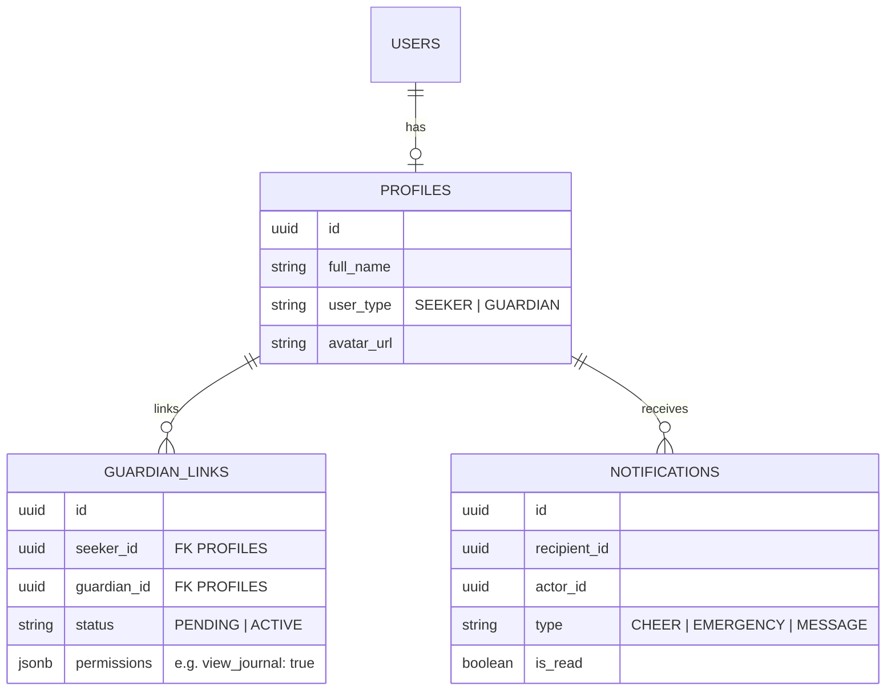

# ECC Planning Session: Recoverly Phase 3-5

## 📋 Session Context
This planning session follows the **Everything Claude Code (ECC)** Longform Guide patterns, prioritizing sequential phases, robust architecture, and verification loops.

**Current Repo State:**
- Home Dashboard (Phase 1) is 1:1 with Figma.
- Tracker & Journal (Phase 2) are stable with offline persistence.
- Phase 3 (Meetings) and Phase 4-5 (Guardian Ecosystem) remain as placeholders or unrefined implementations.

---

## 1. Phase 3: Meetings & Favorites (Refinement)
**Current Implementation:** `app/(app)/meetings.tsx`, `app/(app)/favorites.tsx`
**Refinement Focus:** Premium UX and persistence.

### Tasks:
- [ ] **Filter Persistence**:
    - [ ] Audit `store/meetings.ts` (if search state is held there).
    - [ ] Ensure selections in `meetings-filter.tsx` reflect immediately on return to `meetings.tsx`.
- [ ] **Premium Empty States**:
    - [ ] Create `components/ui/EmptyState.tsx` with vibrant illustrations (using `generate_image` assets).
    - [ ] Apply to `favorites.tsx` when no meetings are bookmarked.
- [ ] **Detail View Optimization**:
    - [ ] Ensure meeting details (location, time) open in a modal rather than a full-navigate to keep local map context.

---

## 2. Phase 4: Guardian Ecosystem (Architecture & Design)
**Goal:** Connect the "Seeker" (Recoverly App) with their "Guardian" (Guardian App).
**Standard:** Use Mermaid to visualize the cross-app data relationship.

### 🏗️ Data Architecture

### 🛣️ Implementation Strategy:
1.  **Discovery (Sober Pal)**:
    - [ ] Transform `sober-pal.tsx` to search `profiles` where `user_type = 'SEEKER'`.
    - [ ] Use `find-users.tsx` as a base for filtering by "recovery interest".
2.  **Linking Logic**:
    - [ ] User generates a 6-digit "Guardian Code" in Recoverly.
    - [ ] Guardian enters Code in Guardian App -> creates `GUARDIAN_LINKS` (PENDING).
    - [ ] Seeker approves -> status = ACTIVE.
3.  **Cheering System**:
    - [ ] Use **Stream Activity Feed** to post "Check-in wins".
    - [ ] Guardians can react/cheer which triggers a real-time notification.

---

## 3. Phase 5: Notifications Integration
**Current Implementation:** Static `notifications.tsx` screen.
**Standard:** Real-time listeners.

### Tasks:
- [ ] **Infrastructure**:
    - [ ] Create `supabase/notifications.sql` with RLS allowing actors to insert but only recipients to read.
- [ ] **Realtime Hook**:
    - [ ] Implement `hooks/useNotifications.ts`.
    - [ ] Use `supabase.channel('public:notifications')` to subscribe to inserts.
- [ ] **Global UI Component**:
    - [ ] Add `NotificationBadge` to the `Home` and `Profile` headers.
    - [ ] Ensure the count updates without a full screen refresh.

---

## 4. Verification Plan (ECC Standard)
Every task must pass the following loop:
1. **Lint/Check**: `npx tsc --noEmit`.
2. **Visual Audit**: Compare against Figma design tokens.
3. **EAS Build**: Run `npm run build:android` to verify on physical hardware.
4. **Autonomous Fix**: If EAS build fails, resolve logs immediately.

---

## 🚀 Next Action
**Current Priority**: Refine **Phase 3 (Meetings)** filter persistence and empty states to finish the "Discovery" block before moving to the complex "Guardian" backend logic.

> [!NOTE]
> I recommend starting with the `EmptyState` component design as it will immediately lift the "Premium" feel of the unfinished screens.
